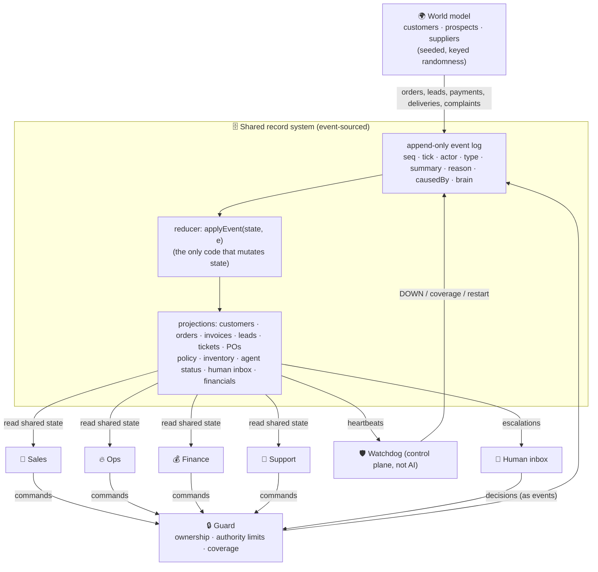

# Architecture snapshot

## 1. Shape of the system

**One tick = one simulated hour.** Inside a tick the order is fixed and documented (`simulation.ts`):

1. injected faults (scenario chaos or the 💥 button)
2. the world moves (orders, leads, payments, deliveries, complaints, day close)
3. human SLAs: open escalations past their deadline get their **safe default**
4. agents act in order **Ops → Sales → Support → Finance** (each one sees what the previous one wrote)
5. the watchdog checks heartbeats
6. a KPI snapshot is taken

## 2. Shared state

`CompanyState` (see `src/engine/types.ts`) is the single source of truth. No agent keeps private state between ticks — everything an agent knows it reads from the records, everything it does it writes as an event.

| Record | Written by | Read by |
|---|---|---|
| `leads` | world (arrive, respond, go cold), Sales (quote, park, win, lose), Support (acknowledge — only while covering Sales) | Sales, Support |
| `customers` | Sales (create), Support (health, retention), Finance (credit hold), world (churn, health drift) | all |
| `orders` | world (place), Ops (ship) | Ops, Support, Finance |
| `invoices` | Finance (issue, remind, write off), world (pay) | Finance |
| `tickets` | world (open), Support (resolve), Sales (resolve — only while covering Support) | Support, Sales, Finance |
| `purchaseOrders` | Ops (request/place/cancel), Finance (approve/place while covering Ops), world (deliver) | Ops, Finance |
| `policy` | Finance (`maxDiscount`, `overtimeAllowed`), Ops (`salesThrottle`), human | everyone — this is how roles steer each other |
| `agents` | watchdog (detected down / coverage), reducer (heartbeats from any agent event) | everyone — peers learn about failures **only** here |
| `inbox` | any agent or watchdog (raise), Finance (resolve peer requests), human (resolve), system (SLA expiry) | raising agent acts on the decision |

**Replay.** `replay(events, tick)` folds the log from `SIM_STARTED` (which carries the initial snapshot) up to any tick. It never re‑runs agents, the world model or an LLM, so it is exact even for runs with human or LLM decisions. `verifyReplay()` hashes the live state and the rebuilt state and compares them (✓ button in the UI, asserted in tests).

**Determinism.** World randomness is `rand(seed, key)` keyed by record ids and ticks — order‑independent. Ids come from per‑type counters (`L‑7`, `O‑12`, `INV‑3`). The same seed + the same human decisions → the same week.

## 3. Agent roles

| Role | Mandate | Owns (may write) | Acts alone up to | Asks |
|---|---|---|---|---|
| 🤝 **Sales** | profitable growth without over‑selling capacity | leads, quotes, new customers | discount ≤ `maxDiscount` (12 %, tuned by Finance) | Finance ≤ 20 %, human above |
| 🔥 **Ops** | roast, ship on time, keep beans in stock | roasting, shipping, inventory, POs, `salesThrottle` signal | POs ≤ $2,500 | Finance ≤ $6,000, human above; human for capacity investments |
| 💰 **Finance** | bill, collect, protect margin & runway | invoices, reminders, credit holds, PO/discount approvals, `maxDiscount`, `overtimeAllowed` | approves POs ≤ $6,000, discounts ≤ 20 % | human for write‑offs and new capital |
| 💬 **Customer Success** | resolve tickets, warn early, prevent churn | tickets, credits, health, retention offers | credits ≤ $100 per ticket, retention discount ≤ `maxDiscount` | human above |
| 🛡️ Watchdog | liveness (deliberately **not** an AI) | agent status, coverage, restarts | — | human for manual restart |

Each agent is a separate module with its own `act(ctx)`; the `AgentContext` it receives can only `emit` events **as that role**. Every event carries a `reason` (why) — the audit trail is the log.

### Judgement calls (the “brain”)

Agents compute a rule‑based default for every judgement call. `RuleBrain` (default) returns it; the optional Claude brain may pick another listed option and gives a rationale. Either way the resulting command goes through the guard. Judgement calls today: Sales discount quote, Support response to an at‑risk account, Finance credit‑hold decision.

## 4. Escalation rules

Escalation is a record (`Escalation` in the inbox) with `from`, `to` (`finance` or `human`), `recommendation`, `slaAt`, and `onExpiry` (the safe default).

| Trigger | Raised by | Goes to | Safe default if nobody answers |
|---|---|---|---|
| discount > Sales cap and ≤ 20 % | Sales | **Finance** (approves if margin allows) | reject → quote at cap |
| discount > 20 %, or Finance is down | Sales | human | reject → quote at cap |
| PO > $2,500 and ≤ $6,000 | Ops | **Finance** (approves if cash stays above ½ floor) | approve (a stock‑out is worse) |
| PO > $6,000, or Finance is down | Ops | human | approve |
| credit > $100 per ticket | Support | human | reject → apology only |
| retention discount > cap | Support | human | reject → personal call |
| write‑off of an invoice > 6 days overdue | Finance | human | reject → keep chasing |
| cash below floor | Finance | human (“inject a $5,000 bridge?”) | reject; overtime already disabled |
| committed demand ≥ 90 % of roaster capacity | Ops | human (“add a second shift?”) | reject → stay small, Sales keeps waitlisting |
| agent silent > 4 h | Watchdog | human (“restart manually?”) | stay in degraded mode; auto‑restart every 6 h |

## 5. Failure handling (coverage matrix)

| Role down | Detected by | Covered by | Degraded behaviour |
|---|---|---|---|
| Ops | watchdog (heartbeats) | Finance | Finance places bean re‑orders within Ops' limit · Sales stops closing deals (can't confirm capacity) and waitlists them · Support warns every customer with an order due in 24 h · nobody else may roast or ship |
| Finance | watchdog | (Ops routes around) | PO and discount approvals go straight to the human · invoicing queues and catches up on return |
| Sales | watchdog | Support | Support acknowledges inbound leads so they don't go cold — but may not quote |
| Support | watchdog | Sales | Sales resolves **high‑severity** tickets with half the credit authority · Finance pauses dunning on customers with open tickets |

Coverage is enforced by the guard: a covering role may emit only the listed event types, and only while the watchdog's `COVERAGE_ASSIGNED` record exists.

## 6. Self‑correcting loops (no human)

- **Capacity**: backlog > 1.1 days → Ops starts overtime; > 1.6 days → Ops sets `salesThrottle` → Sales waitlists deals; both are released automatically when backlog drops.
- **Supply**: primary PO > 6 h past ETA → Ops cancels and re‑orders from the backup supplier; < 1 day of stock with nothing arriving → expedite. Reorder point scales with burn rate.
- **Margin**: trailing 2‑day contribution margin below target → Finance lowers Sales' discount cap (24 h cool‑down); restores it when margin recovers.
- **Cash / collections**: cash below floor → overtime disallowed; overdue → reminders → credit hold → Ops stops shipping to that customer → hold released when paid.
